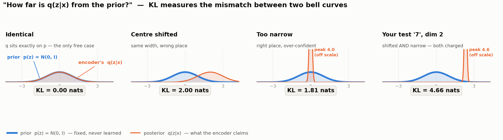

# Convolutional VAE on MNIST — Study Notes

Source: [`variational_autoencoder.py`](variational_autoencoder.py) · Checkpoint: `vae_outputs/conv_vae_mnist.pt` · Inference: [`vae_inference.py`](vae_inference.py)

> **In one sentence:** an autoencoder learns to *compress*; a VAE learns to compress **into a space you can sample from**, and it buys that property with one extra loss term and one clever trick for keeping gradients alive through random sampling.

---

## The architecture

```text
┌── INPUT ──────────────────────────────────────┐   ┌── CONFIG ─────────────────────┐
   MNIST digit  x   [B, 1, 28, 28]   ∈ [0,1]          latent_dim = 2   <-- bottleneck
   transforms.ToTensor()  — NO normalize              Adam  lr=1e-3 · batch=128
   (Sigmoid decoder emits [0,1]; BCE target           kl_warmup_frac = 0.3
    must live on the same interval)                   epochs = 5
└──────────────────────┬────────────────────────┘   └───────────────────────────────┘
                       │
       ╔═══════════════▼══════════════════════════════════════════════╗
       ║  ENCODER   self.enc  ·  55,744 prm (46.9%)                   ║
       ║    Conv2d( 1 -> 32, k3, s2, p1) + ReLU   ->  [32, 14, 14]    ║
       ║    Conv2d(32 -> 64, k3, s2, p1) + ReLU   ->  [64,  7,  7]    ║
       ║    Conv2d(64 -> 64, k3, s1, p1) + ReLU   ->  [64,  7,  7]    ║
       ║    stride-2 twice = the only downsampling (no pooling)       ║
       ╚═══════════════╤══════════════════════════════════════════════╝
                       │  h.view(B, -1)   # flatten -> [B, 3136]
            ┌──────────┴───────────┐
            ▼                      ▼
    ┌───────────────┐      ┌───────────────┐
    │ fc_mu         │      │ fc_logvar     │      TWO heads on ONE feature vector
    │ Linear 3136->2│      │ Linear 3136->2│      = the "encoder outputs a
    │ 6,274 prm     │      │ 6,274 prm     │        DISTRIBUTION, not a point"
    └───────┬───────┘      └───────┬───────┘
            │ mu  [B,2]            │ logvar  [B,2]
            │                      │   why log-variance? unconstrained in R,
            │                      │   exp() makes it positive for free
            │                      ▼
            │              std = exp(0.5 * logvar)      [B,2]
            │                      │
            │                      │          eps ~ N(0, I)   <<S>>   [B,2]
            │                      │                 │  fresh sample every forward
            └──────────┬───────────┴─────────────────┘
                       ▼
     ╭─────────────────────────────────────────────────────────╮
     │  REPARAMETERIZATION TRICK   <<S>>   the whole point     │
     │        z = mu + eps * std                               │
     │  randomness is a LEAF input (eps), never a node to      │
     │  differentiate through:  dz/dmu = 1 ,  dz/dstd = eps    │
     │  -> the sampling stays stochastic AND backprop works    │
     ╰─────────────────────────┬───────────────────────────────╯
                               │
                          z  [B, 2]      <-- THE LATENT CODE
                               │          (at inference, use mu and skip eps)
                               ▼
       ╔═══════════════════════════════════════════════════════════════╗
       ║  DECODER   ·  50,561 prm (42.5%)                              ║
       ║    fc_dec  Linear(2 -> 3136)   9,408 prm                      ║
       ║      .view(B, 64, 7, 7)      # un-flatten                     ║
       ║    ConvTranspose2d(64 -> 32, k4,s2,p1) + ReLU -> [32, 14, 14] ║
       ║    ConvTranspose2d(32 -> 16, k4,s2,p1) + ReLU -> [16, 28, 28] ║
       ║    Conv2d(16 -> 1, k3, s1, p1)                -> [ 1, 28, 28] ║
       ║    Sigmoid                                    -> pixels [0,1] ║
       ╚═══════════════════════╤═══════════════════════════════════════╝
                               ▼
              x_hat  [B, 1, 28, 28]   per-pixel Bernoulli mean
                               │
   ┌───────────────────────────▼─────────────────────────────────────────────┐
   │  LOSS = negative ELBO          (per-sample, then .mean() over batch)    │
   │                                                                         │
   │      RECONSTRUCTION                +   beta *   KL DIVERGENCE           │
   │      BCE(x_hat, x).sum(784 px)             -0.5 * sum(1 + logvar        │
   │      [B]                                          - mu^2 - exp(logvar)) │
   │      "look like the input"                 [B]  closed form vs N(0,I)   │
   │             |                                        |                  │
   │             v                                        v                  │
   │      spreads codes APART                   pulls codes TO THE ORIGIN    │
   │      (memorize)                            (smooth, samplable space)    │
   │                                                                         │
   │      beta = min(1, it / warmup_iters)   <-- KL warmup, 0->1 over the    │
   │      warmup_iters = 0.3 * total_iters       first 30% of iterations.    │
   │      Early beta~0 == plain autoencoder: learn to reconstruct FIRST,     │
   │      then tighten the prior. This is what prevents posterior collapse.  │
   │      NOTE: --beta is IGNORED unless you also set --kl_warmup_frac 0     │
   └─────────────────────────────────────────────────────────────────────────┘

  LEGEND   <<S>> stochastic node   [B,...] batched tensor
```

---

## 1. Why not just an autoencoder?

You already have [`autoencoder.py`](autoencoder.py) in this repo. Diff the two encoders and the entire idea of a VAE falls out:

| | `ConvAE` (autoencoder.py) | `ConvVAE` (variational_autoencoder.py) |
|---|---|---|
| Encoder output | `fc_mu` only → **a point** `z` | `fc_mu` **and** `fc_logvar` → **a distribution** |
| Sampling | none | `z = mu + eps*std` |
| Loss | `BCE` only | `BCE + beta*KL` |
| Can you sample new digits? | **No** | **Yes** |

A plain autoencoder is free to scatter its codes anywhere in the plane — clusters at (0,0), at (900, −40), wherever minimizes reconstruction error. Nothing constrains the space *between* the clusters. Draw a random `z` and the decoder produces garbage, because no training example ever landed there.

The VAE fixes this with two pressures acting together:

1. **Noise during training.** Every forward pass decodes `mu + eps*std`, not `mu`. The decoder never sees the exact same code twice, so it is forced to make *neighborhoods* decode sensibly, not just points.
2. **The KL term** drags every `q(z|x)` toward `N(0, I)`. All the codes end up packed into the same unit-scale blob around the origin, with no dead space between them.

Together: **any `z` you draw from `N(0,I)` lands somewhere the decoder understands.** That is the entire payoff, and it is what makes `--mode sample` and `--mode manifold` work at all.

---

## 2. The encoder: two heads, one trunk

```python
h = self.enc(x)              # [B, 64, 7, 7]  three convs
h = h.view(x.size(0), -1)    # [B, 3136]      flatten
mu, logvar = self.fc_mu(h), self.fc_logvar(h)
```

The convolutional trunk is ordinary. The interesting part is that **two separate `Linear` layers read the same 3136-dim feature vector**. They are siblings, not sequential. That is the structural signature of a VAE.

For each input image the encoder answers: *"where in latent space does this digit live (`mu`), and how sure am I (`logvar`)?"* An ambiguous scrawl can output a large variance, effectively saying "somewhere in this region"; a crisp `1` can output a tiny one.

**Why log-variance instead of variance or std?** A network output is an unconstrained real number, but variance must be positive. Predicting `logvar` and taking `exp(0.5*logvar)` makes positivity automatic — no clamping, no ReLU, no risk of `sqrt` of a negative. It also gives better-conditioned gradients across many orders of magnitude.

---

## 3. The reparameterization trick — the actual core idea

```python
def reparameterize(self, mu, logvar):
    std = torch.exp(0.5 * logvar)
    eps = torch.randn_like(std)
    return mu + eps * std
```

**The problem it solves.** You want to train through a sampling operation `z ~ N(mu, sigma^2)`. But "sample from a distribution" is not a differentiable function of `mu` and `sigma` — there's no `d(sample)/d(mu)`, because sampling is not a deterministic op at all. Backprop hits it and stops. The encoder would receive no gradient.

**The trick.** Move the randomness out of the path. Instead of sampling `z` *from* a distribution parameterized by the network, sample a fixed, parameter-free `eps ~ N(0, I)` and then apply a **deterministic, differentiable** transform:

```
z = mu + eps * std
```

`eps` enters the graph as a **leaf** — a constant, as far as autograd is concerned. Everything else is multiplication and addition:

```
dz/dmu  = 1        dz/dstd = eps
```

Gradients flow straight back into `fc_mu` and `fc_logvar`. The sample is still genuinely random (`eps` is redrawn every forward pass), but the randomness no longer sits *between* the loss and the weights — it sits *beside* the path, injected from outside.

That's it. That one line is what makes the whole model trainable, and it's why the technique is named in the paper's title.

**A useful check:** in [`vae_inference.py`](vae_inference.py) all three modes deliberately **skip** `reparameterize`. At inference you want determinism, so reconstruction uses `mu` directly, and generation draws `z ~ N(0,I)` and goes straight to `decode`. `eps` is a training-time device.

---

## 4. The decoder: mirror image

```python
h = self.fc_dec(z).view(z.size(0), 64, 7, 7)   # 2 -> 3136 -> [64,7,7]
x_hat = self.dec(h)                            # upsample back to 28x28
```

`fc_dec` re-inflates 2 numbers into 3136, reshaped to a `[64, 7, 7]` feature map. Then two `ConvTranspose2d` layers double the resolution each (7→14→28), a final `Conv2d` collapses 16 channels to 1, and `Sigmoid` squashes to `[0, 1]`.

**Why `Sigmoid` matters:** the loss is `binary_cross_entropy`, which requires both arguments in `[0,1]`. This is also why the data pipeline uses bare `transforms.ToTensor()` with **no** `Normalize` — normalizing to mean 0 would put targets outside `[0,1]` and BCE would produce `NaN`. The three choices (ToTensor / Sigmoid / BCE) are locked together; change one and you must change all three.

**Kernel size 4, not 3.** `ConvTranspose2d(k=4, s=2, p=1)` exactly doubles spatial size with no `output_padding` fudge. Your `autoencoder.py` uses `k=3, s=2, p=1, output_padding=1` and ends up at 32×32 needing a crop — the `k=4` formulation is cleaner.

---

## 5. The loss: negative ELBO

```python
bce = F.binary_cross_entropy(x_hat, x, reduction="none")
bce = bce.view(bce.size(0), -1).sum(dim=1)                     # per-sample, summed over 784 px
kld = -0.5 * torch.sum(1 + logvar - mu.pow(2) - logvar.exp(), dim=1)
loss = (bce + beta * kld).mean()
```

The two terms measure completely different things. **Reconstruction compares images to images.
KL compares distributions to distributions and never looks at a pixel.**

### Term 1 — reconstruction: `BCE(original pixels, reconstructed pixels)`

Yes — literally the input image against the decoder's output image. For each of the 784 pixels:

```
per-pixel loss = -[ x * log(x_hat) + (1 - x) * log(1 - x_hat) ]

    x      = the TRUE pixel value      in [0,1]   (target)
    x_hat  = the DECODER's pixel value in [0,1]   (Sigmoid output)
```

Read it as two halves that switch on and off:

- If the true pixel is **white** (`x = 1`), only `-log(x_hat)` survives -> "you should have predicted 1".
- If the true pixel is **black** (`x = 0`), only `-log(1 - x_hat)` survives -> "you should have predicted 0".
- Grey pixels (`0 < x < 1`) blend both. MNIST's anti-aliased edges are treated as *soft* targets:
  the pixel is a Bernoulli variable that is on with probability `x`.

The loss is 0 when `x_hat == x` and grows without bound as the prediction moves the wrong way.
Verified against the definition on one test image (a `7`):

```
manual  -[x*log(xhat) + (1-x)*log(1-xhat)]  summed over 784 px  =  92.0499
torch   F.binary_cross_entropy(x_hat, x, reduction='none').sum() =  92.0499

  a black pixel   target x=0.000  pred xhat=0.000  ->  loss = 0.0000   (free)
  a bright pixel  target x=1.000  pred xhat=0.665  ->  loss = 0.4078   (penalised)
```

Every pixel produces its own number — you get a 28x28 **map of loss**, one entry per pixel — and
those 784 numbers are then **summed**, giving one scalar per image. Finally the batch is averaged.

The `sum` (not `mean`) over pixels is deliberate: it puts reconstruction on the same scale as the KL,
which is also a sum. Use `mean` and reconstruction becomes ~784x too weak, KL dominates, and the
model collapses to emitting the average digit.

### Term 2 — KL divergence: `(mu, sigma)` vs `(0, 1)`

**In three steps, that is the whole term:**

1. **`p(z) = N(0, I)` is assumed up front.** Fixed, chosen before training ever starts,
   never learned. Nothing about it updates.
2. **During training the encoder produces `mu` and `logvar`** for each image, fresh on every
   forward pass. `sigma = exp(0.5 * logvar)`.
3. **The KL term compares `(mu, sigma)` against `(0, 1)`.** That is its entire input:

```python
kld = -0.5 * torch.sum(1 + logvar - mu.pow(2) - logvar.exp(), dim=1)
```

Only `mu` and `logvar` appear. **No `x`, no `x_hat`** — the KL term never looks at a pixel.
And it is zero exactly when `mu = 0` and `sigma = 1`.

Three refinements on that summary:

- **Per image, per dimension.** Every image gets its own `mu`, `sigma`; every latent dimension
  contributes its own penalty; those are summed across dims (`dim=1`), then the batch is averaged.
- **It is not a plain distance.** You might expect `(mu - 0)^2 + (sigma - 1)^2`. KL is a specific
  *asymmetric* formula that punishes `sigma` too **small** far harder than too **large** —
  `-log(sigma^2)` blows up as `sigma -> 0`. But the intuition holds: zero at the match, growing away from it.
- **"0 and 1" means per dimension.** With `latent_dim=2` the target is `mu = [0,0]`, `sigma = [1,1]`.
  That is what the `I` in `N(0, I)` denotes.

#### Why doesn't the encoder just cheat?

If the loss wants `mu = 0` and `sigma = 1`, why not emit exactly that for every image and score zero?

**Because that is only half the loss.** An encoder doing that has thrown the image away: every input
maps to the same code, the decoder gets no information, and the reconstruction term explodes.

```
loss = BCE(pixels)  +  beta * KL(mu,sigma vs 0,1)
       ^ needs mu to DIFFER per image     ^ wants every mu at 0
```

The two terms pull against each other and the trained model settles at the compromise — which is why
your latent came out at `mu.std = 1.135`: spread enough to tell digits apart, tight enough to stay in
the prior's territory. When KL wins too early the encoder *does* collapse to `mu=0, sigma=1` and never
recovers; that is posterior collapse, and the warmup in section 6 exists to prevent it.

#### What "how far" means between two distributions

Two distributions drawn on the same axis are two bell curves. "Far" = how badly they disagree.
A Gaussian has only two knobs, so mismatch takes only two forms:



| q's problem | what it looks like | panel |
|---|---|---|
| **Wrong place** — `mu != 0` | bell sits off to the side | *Centre shifted*, KL = 2.00 |
| **Wrong width** — `sigma != 1` | too narrow (over-confident) or too broad | *Too narrow*, KL = 1.81 |

Match both and the curves lie on top of each other: **KL = 0**, the only free case.

The closed form is exactly those two penalties added together:

```
KL per dimension = 0.5 * ( mu^2  +  sigma^2 - 1 - log(sigma^2) )
                           ^                ^
                     wrong place        wrong width

full term:  KL = -0.5 * sum_over_dims( 1 + log(sigma^2) - mu^2 - sigma^2 )
```

Split the real test `7` (`mu = [0.9236, 2.3296]`, `sigma = [0.0718, 0.0870]`) and each penalty is visible:

| | `mu` | `sigma` | wrong-place part | wrong-width part | total |
|---|---:|---:|---:|---:|---:|
| dim 1 | 0.924 | 0.072 | 0.427 | 2.136 | **2.563** |
| dim 2 | 2.330 | 0.087 | 2.714 | 1.946 | **4.659** |
| | | | | | **7.222 nats** |

Dim 2 is punished mostly for being in the wrong *place*; dim 1 mostly for being too *narrow*.

#### The formal definition, and why the code uses a shortcut

```
KL = average over z drawn from q  of   log( q(z) / p(z) )
```

In words: sample a `z` from where the encoder says the image lives, ask how much more likely `q`
thinks that `z` is than `p` does, and average. Identical curves give a ratio of 1 everywhere,
`log 1 = 0`, so KL = 0.

That average can be estimated by brute force, and it agrees with the closed form:

```
closed form   -0.5*sum(1 + logvar - mu^2 - exp(logvar))   =  7.222315
Monte-Carlo   E_q[ log q(z) - log p(z) ], 2M samples      =  7.222866   <- agrees
torch.distributions.kl_divergence(q, p)                   =  7.222316
```

The closed form gives the identical answer instantly and differentiably, which is why the code uses it.
Regenerate the figure with [`vae_kl_figure.py`](vae_kl_figure.py).

### Putting them together on one image

```
loss = BCE + beta * KL = 92.0499 + 1.0 * 7.2223 = 99.2722
```

Reconstruction dominates by ~13x. That ratio is the reason the KL warmup matters — see section 6.

### The tug-of-war

This is the sentence to remember:

> **Reconstruction wants to spread codes apart. KL wants to pull them to the origin. The latent space you get is the truce.**

- KL only → all codes collapse to `N(0,I)`, the latent carries no information, every output is the same blurry digit. (**posterior collapse**)
- Recon only → a plain autoencoder, arbitrary code placement, unsamplable gaps.
- Balanced → clusters that are *distinct enough to decode* but *packed tightly enough to sample between*. That is exactly the picture in `vae_outputs/latent_scatter.png`.

---

## 6. KL warmup, and the bug it hides

```python
if warmup_iters > 0:
    beta = min(1.0, it / warmup_iters)   # 0 -> 1 over the first 30% of training
else:
    beta = args.beta
```

Early in training the decoder is useless, so reconstruction loss is huge and the cheapest way to cut total loss is to zero out the KL — set `sigma = 1`, `mu = 0`, ignore the input entirely. That's **posterior collapse**, and it's a trap the model can't climb out of.

The warmup starts at `beta ≈ 0` (pure autoencoder — *learn to reconstruct first*) and ramps to `beta = 1` over the first 30% of iterations, tightening the prior only once the decoder is worth constraining. Your loss curve shows it working: KL spikes to ~70 in the first few iterations, then settles to ~6 and stays there.

> ⚠️ **Gotcha:** because `kl_warmup_frac` defaults to `0.3`, `warmup_iters > 0` is always true and **`--beta` is silently ignored**. To run a β-VAE experiment you must *also* pass `--kl_warmup_frac 0`:
> ```bash
> python variational_autoencoder.py --kl_warmup_frac 0 --beta 4.0 --epochs 20 --outdir ./vae_outputs_beta4
> ```

---

## 7. What your trained model actually achieved

Measured on the MNIST test set with `vae_outputs/conv_vae_mnist.pt` (5 epochs, 2345 iterations):

| | ELBO | Recon (BCE) | KL | `mu.std` |
|---|---|---|---|---|
| **Trained** | **150.08** | 144.14 | 5.94 | **1.135** |
| Random init | 522.43 | 522.43 | 0.00 | 0.017 |

Two diagnostics worth internalizing:

- **`mu.std = 1.135`** — close to 1, matching the prior. The latent is being *used*. Had this come out near 0 with `KL ≈ 0`, that would be posterior collapse.
- **`KL = 5.94` nats** — this is literally the information capacity of the bottleneck: about 5.94 nats ≈ **8.6 bits** to describe a digit. MNIST has 10 classes (3.3 bits) plus style, so 8.6 bits is plausible but tight. This number is *why* reconstructions are blurry.

Parameter budget — **118,853 total**, unusually symmetric:

| Block | Params | Share |
|---|---:|---:|
| Encoder convs | 55,744 | 46.9% |
| `fc_mu` + `fc_logvar` | 12,548 | 10.6% |
| `fc_dec` | 9,408 | 7.9% |
| Decoder deconvs | 41,153 | 34.6% |

---

## 8. Reading your own latent space

The three visualizations aren't decoration — each tests a different property.

**`latent_scatter.png` — is the space organized?** Colors form contiguous regions rather than being shuffled. `1` (orange) owns the whole upper-left, `0` (blue) the bottom, `6` (grey) the upper-right. The center is a mush of `3`/`5`/`8`. Nobody told the model about digit classes — this structure is a pure byproduct of "reconstruct well while staying near `N(0,I)`".

**`interpolation.png` / `--mode interpolate` — is the space smooth?** Walking a straight line between two codes must produce valid digits the whole way. It does. But note what you observed on `--digits 1 8`: eight frames stayed a `1` before flipping. Latent distance is not perceptual distance — the `1` region is huge because `1`s are distinctive and easy to encode, so a constant-speed walk spends most of its time inside it.

**`manifold.png` — what does the model think digit-space *is*?** A 20×20 sweep over `z` decoded directly. Read the class layout right off it: `1` top-left → `7`/`9` across the top → `8`/`5`/`3` down the middle → `6`/`0` along the bottom. This picture only exists because the KL term made the prior region meaningful everywhere.

**`--mode reconstruct` — how much did the bottleneck destroy?** Per-digit BCE tells you exactly which digits the 2-D code can't hold:

| digit | BCE | latent `mu` | why |
|---|---:|---|---|
| 1 | **34.7** | [−2.82, +1.61] | far out, own territory, near-perfect |
| 7 | 92.6 | [+0.92, +2.33] | isolated, good |
| 5 | **328.8** | [+0.12, +0.12] | sits at the origin in the `3`/`5`/`8` pileup → decodes as a blurry `3` |

### The 5-NN probe — is the space organised by *meaning*?

The three pictures above are qualitative. [`vae_knn_probe.py`](vae_knn_probe.py) turns the same
question into one number.

Think of the encoder as assigning **map coordinates** to every image: feed in a picture, get back a
short list of numbers (2 for `vae_d02`, 16 for `vae_d16`). That list is the image's address in latent
space. The probe asks: **do pictures of the same digit end up at nearby addresses?**

That is not guaranteed. The VAE trains *without labels* — `vae_loss` only ever compares pixels.
Nobody told it to put the `4`s together. If they cluster anyway, it is because grouping similar-looking
things was the natural way to compress them.

What the script does:

1. Encode **10,000 training images** -> 10,000 addresses. Remember what digit each one really was.
2. Take **test image #42** (a `4`) -> encode it -> one address.
3. Compute the distance from #42's address to all 10,000 others. Keep the **5 closest**.
4. Look up what those 5 neighbours actually were: `[4, 9, 4, 4, 9]`.
5. **Majority vote** -> three `4`s beat two `9`s -> predict `4`. Correct.
6. Repeat for **2,000 test images**. **64.3%** correct for the 2-D model, **94.7%** for the 16-D one.

```bash
python vae_knn_probe.py --probe 42                     # writes knn_*_probe42.png
python vae_knn_probe.py --probe 8 --ckpt vae_sweep_outputs/vae_d*.pt
```

It also saves a strip per model — leftmost is the query, then its 5 neighbours — so you can see the
digits rather than just their labels:

```
vae_d02 (2-D) : query 4 | 4  9  4  4  9      three 4s, two 9s -> squeaks through 3-2
vae_d16 (16-D): query 4 | 4  4  4  4  4      unanimous
```

`4` and `9` differ mainly by whether the top loop closes. Two numbers cannot store that detail, so the
2-D model files them in the same neighbourhood. Sixteen numbers can.

**Why bother, when we already have reconstruction BCE?** They catch different failures:

| metric | question | catches |
|---|---|---|
| recon BCE | can the decoder rebuild the *pixels*? | blur, lost stroke detail |
| 5-NN acc | is the space organised by *meaning*? | classes overlapping |

A model can reconstruct sharply while scrambling classes, or cluster classes while producing blur.
Reporting both tells you which problem a given `latent_dim` has. Chance is 10%; raw pixels give ~97%.

The word **probe** is load-bearing: it is a measuring instrument attached *after* training. It changes
nothing about the model, and the model never sees its result.

---

## 9. Choosing `latent_dim` — the 2 is a teaching choice, not a good one

`latent_dim` is a completely free hyperparameter: any positive integer, no power-of-2 requirement.
`fc_mu` is `Linear(3136 -> latent_dim)` and `fc_dec` is `Linear(latent_dim -> 3136)`; both adapt.

**2 exists so the latent can be *plotted*.** A scatter needs an x and a y, and
[line 249](variational_autoencoder.py#L249) skips the scatter and manifold unless `latent_dim == 2`.
It is a poor choice for reconstruction quality.

Measured by [`vae_latent_sweep.py`](vae_latent_sweep.py) — 5 epochs each, identical seed and
schedule, full 10k test set. Raw numbers in `vae_sweep_outputs/results.csv`:

| dim | recon BCE | KL | ELBO | 5-NN acc | bits | active units | params |
|---:|---:|---:|---:|---:|---:|:---:|---:|
| 1 | 168.90 | 3.29 | 172.19 | 49.9% | 4.7 | 1/1 | 109,443 |
| **2** | **149.63** | **5.61** | **155.24** | **64.5%** | **8.1** | **2/2** | **118,853** |
| 4 | 121.57 | 9.69 | 131.26 | 78.7% | 14.0 | 4/4 | 137,673 |
| 8 | 94.06 | 16.64 | 110.70 | 90.2% | 24.0 | 8/8 | 175,313 |
| 16 | **79.35** | 23.98 | **103.33** | 94.0% | 34.6 | 16/16 | 250,593 |
| 32 | 76.73 | 26.96 | 103.69 | 95.1% | 38.9 | 32/32 | 401,153 |

**5-NN acc** is a *probe*, not part of the model: encode 10k train images to `mu`, encode 2k test
images, classify each by majority vote of its 5 nearest training codes. The VAE never sees labels,
so this asks whether same-digit images landed near each other anyway. Chance is 10%; raw pixels
give ~97%. At `dim=2` it is only 64.5% — the bottleneck destroys a third of the class identity.

What the sweep shows:

- **Diminishing returns, with a knee near 16.** 2 -> 4 buys 28 BCE points; 16 -> 32 buys 2.6, and
  ELBO actually gets *worse* (103.33 -> 103.69) because the extra KL cost outweighs the gain.
  That plateau is roughly MNIST's intrinsic dimensionality — the real degrees of freedom in a
  handwritten digit (slant, thickness, loop size, ...).
- **Rising KL is good.** It is the information the latent carries: 8.1 bits at `dim=2`,
  34.6 bits at `dim=16`. Ten digit classes alone cost 3.3 bits.
- **No dead dimensions.** Even at 32, every dim has per-dim KL above the 0.01-nat threshold.
  Per-dimension posterior collapse is the classic high-`latent_dim` failure mode; the KL warmup
  is preventing it here.

`--latent_dim 3` is an interesting middle ground: still visualizable as a 3-D scatter, and
meaningfully better than 2. The current code would skip the plot — you would need to add a
`latent_dim == 3` branch.

```bash
python vae_latent_sweep.py --dims 1 2 4 8 16 32 --epochs 5      # reproduce the table
python vae_inference.py --ckpt vae_sweep_outputs/vae_d16.pt --mode reconstruct
```

`vae_inference.py` reads `latent_dim` from the checkpoint, so no extra flag is needed. Only
`vae_d02.pt` supports `--mode manifold`.

## 10. Bridge to Stable Diffusion

This is why the file lives in a folder called `stable-diffusion`. SD's first stage is a VAE, and it differs in exactly three ways:

| | This VAE | Stable Diffusion's VAE |
|---|---|---|
| Latent shape | **vector** `[B, 2]` | **spatial** `[B, 4, 64, 64]` |
| How `mu` is produced | `Linear(3136 → 2)` after flatten | `Conv2d` → mu/logvar as *feature maps*, no flatten |
| Recon loss | BCE | L1/L2 + perceptual (LPIPS) + adversarial |

The spatial latent is the crucial one. Keeping a 64×64 grid instead of flattening preserves the 2-D layout, which is what lets a **U-Net run over the latent** — convolutions need spatial structure. A flattened vector would have nothing for a U-Net to convolve.

And the reason for the VAE at all: diffusion on 512×512×3 pixels is ruinously expensive. Compress 512×512×3 → 64×64×4 (a **48× reduction**), run the entire diffusion process in that small space, then decode once at the end. That is precisely what "**latent** diffusion" means. Next stop: [`diffusion_model.py`](diffusion_model.py) and [`tiny_diffusion_cifar.py`](tiny_diffusion_cifar.py).

---

## Gotchas

| Trap | Why | Fix |
|---|---|---|
| `--beta` does nothing | `kl_warmup_frac=0.3` overrides it, [line 220](variational_autoencoder.py#L220) | also pass `--kl_warmup_frac 0` |
| Crash at end of training | `recon_path` used at [line 258](variational_autoencoder.py#L258), assigned only in a commented-out [line 245](variational_autoencoder.py#L245) | delete line 258, or uncomment 245 with an `epoch` arg |
| Adding `Normalize` → `NaN` | BCE needs targets in `[0,1]` | keep bare `ToTensor()` |
| `mean` instead of `sum` over pixels | recon becomes 784× too weak, KL dominates | keep `.sum(dim=1)` |
| No scatter/manifold output | both guarded on `latent_dim == 2` | expected with higher dims |
| Re-running overwrites the checkpoint | `--outdir` defaults to `./vae_outputs` | always pass `--outdir` for experiments |

## Commands

```bash
# train
python variational_autoencoder.py --epochs 20 --outdir ./vae_outputs_run20

# sweep latent_dim (writes checkpoints + results.csv to vae_sweep_outputs/)
python vae_latent_sweep.py --dims 1 2 4 8 16 32 --epochs 5

# inference on real digits
python vae_inference.py --mode reconstruct
python vae_inference.py --mode interpolate --digits 1 0 --steps 12
python vae_inference.py --mode manifold --grid 20
python vae_inference.py --mode all
```

VSCode: **Run and Debug** → *"Python: VAE Inference (interpolate 1 -> 0)"* (`stopOnEntry`, `justMyCode` both on).
